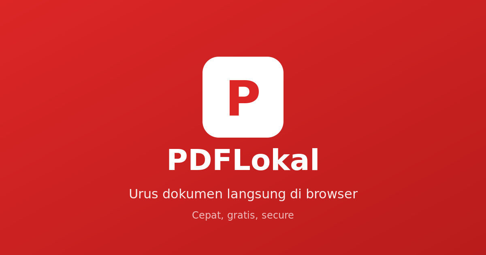

# PDFLokal

> **Urus dokumen langsung di browser.** Cepat, gratis, file tidak pernah diupload.

PDFLokal adalah tool PDF & gambar gratis untuk pengguna Indonesia. Semua proses berjalan di browser - file tidak pernah meninggalkan perangkat Anda.

🌐 **[Buka PDFLokal](https://pdflokal.github.io)** (ganti dengan URL deployment Anda)



## ✨ Fitur

### PDF Tools
- **Gabung PDF** - Gabungkan beberapa PDF menjadi satu
- **Pisah PDF** - Ekstrak halaman atau pisah berdasarkan range
- **Kompres PDF** - Kurangi ukuran file (kompres gambar dalam PDF)
- **Putar PDF** - Putar halaman 90°, 180°, atau 270°
- **Edit PDF** - Whiteout, tambah teks, tambah tanda tangan
- **Atur Halaman** - Reorder, hapus, ekstrak halaman
- **PDF ke Gambar** - Export halaman sebagai PNG/JPG
- **Proteksi** - Tambahkan password ke PDF
- **Buka Kunci** - Hapus password dari PDF (perlu tahu password)
- **Watermark** - Tambahkan watermark teks
- **Nomor Halaman** - Tambahkan nomor halaman otomatis
- **Crop** - Potong halaman PDF

### Image Tools
- **Kompres Gambar** - Kurangi ukuran file dengan kontrol kualitas
- **Ubah Ukuran** - Resize dengan lock aspect ratio
- **Convert Format** - JPG ↔ PNG ↔ WebP
- **Gambar ke PDF** - Gabungkan gambar menjadi PDF

## 🔒 Privasi

- ✅ **100% Client-side** - Semua proses di browser
- ✅ **Tidak ada upload** - File tidak pernah meninggalkan perangkat
- ✅ **Tidak ada tracking** - Tidak ada analytics atau cookies
- ✅ **Open source** - Kode bisa diperiksa siapa saja

## 🚀 Cara Pakai

1. Buka [pdflokal.github.io](https://pdflokal.github.io)
2. Pilih tool yang dibutuhkan
3. Drag & drop file atau klik untuk pilih
4. Proses dan download hasilnya

Tidak perlu install, tidak perlu daftar, tidak perlu bayar.

## 💻 Development

### Prerequisites
- Browser modern (Chrome, Firefox, Safari, Edge)
- Web server lokal (opsional, bisa langsung buka file HTML)

### Run Locally
```bash
# Clone repository
git clone https://github.com/username/pdflokal.git
cd pdflokal

# Buka dengan web server (opsional)
npx serve .
# atau
python -m http.server 8000

# Atau langsung buka index.html di browser
```

### Tech Stack
- **Vanilla HTML/CSS/JS** - No build step, no framework
- **[pdf-lib](https://pdf-lib.js.org/)** - PDF manipulation
- **[PDF.js](https://mozilla.github.io/pdf.js/)** - PDF rendering & thumbnails
- **[Signature Pad](https://github.com/szimek/signature_pad)** - Tanda tangan digital
- **Canvas API** - Image processing

### Project Structure
```
pdflokal/
├── index.html      # Main application
├── dukung.html     # Donation page
├── style.css       # All styles
├── app.js          # Application logic
├── images/
│   ├── qris.png    # QRIS donation code
│   └── og-image.png # Social sharing image
└── README.md
```

## 🤝 Kontribusi

Kontribusi selalu disambut! Beberapa cara untuk berkontribusi:

1. **Laporkan Bug** - Buka issue jika menemukan masalah
2. **Request Fitur** - Sarankan fitur baru via issue
3. **Pull Request** - Perbaiki bug atau tambah fitur
4. **Share** - Ceritakan tentang PDFLokal ke orang lain
5. **Donasi** - Bantu biaya development via [halaman donasi](dukung.html)

### Development Guidelines
- Gunakan vanilla JS, hindari dependencies baru kecuali benar-benar perlu
- Semua fitur harus client-side (tidak boleh butuh server)
- UI harus responsive dan mudah digunakan
- Copy dalam Bahasa Indonesia
- Test di berbagai browser sebelum PR

## ⚠️ Limitasi

Beberapa hal yang perlu diketahui:

1. **Kompres PDF** - Hanya bisa kompres gambar di dalam PDF, bukan struktur PDF itu sendiri
2. **File besar** - File >50MB mungkin lambat atau crash di beberapa device
3. **PDF kompleks** - Beberapa PDF dengan enkripsi atau font khusus mungkin tidak bisa diproses
4. **Browser lama** - Butuh browser modern dengan support ES6+

### Fitur yang Butuh Server (Coming Soon)
- PDF → Word conversion
- PDF → Excel conversion  
- Word/Excel → PDF conversion
- OCR (text recognition)

Fitur ini akan ditambahkan ketika ada resources untuk server-side processing.

## 📄 License

MIT License - bebas digunakan untuk keperluan apapun.

## 🙏 Credits

- [pdf-lib](https://pdf-lib.js.org/) by Andrew Dillon
- [PDF.js](https://mozilla.github.io/pdf.js/) by Mozilla
- [Signature Pad](https://github.com/szimek/signature_pad) by Szymon Nowak
- Inspired by [iLovePDF](https://www.ilovepdf.com/), [Smallpdf](https://smallpdf.com/), dan [Squoosh](https://squoosh.app/)

---

**Made with ❤️ in Indonesia**

Punya pertanyaan? Buka issue atau hubungi via GitHub.
