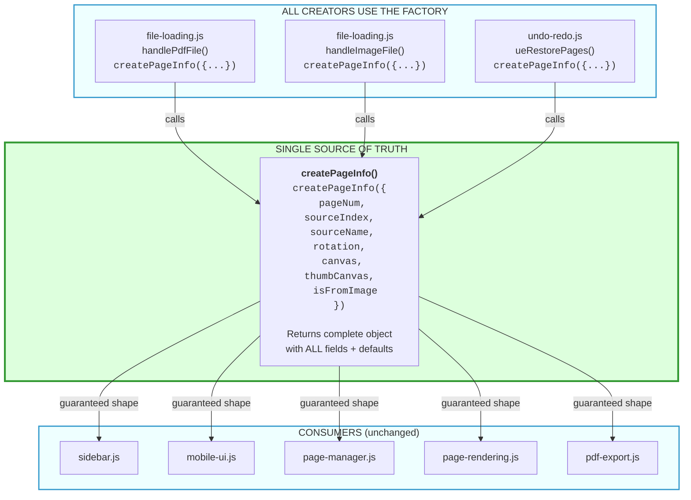
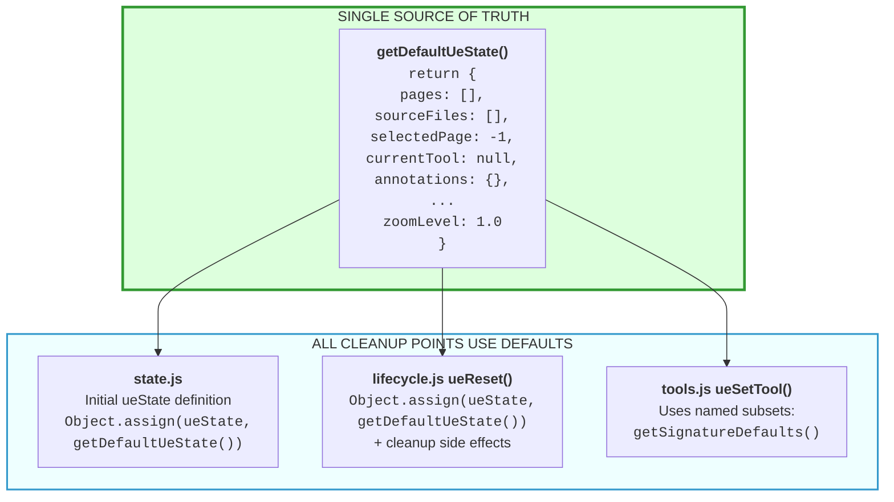
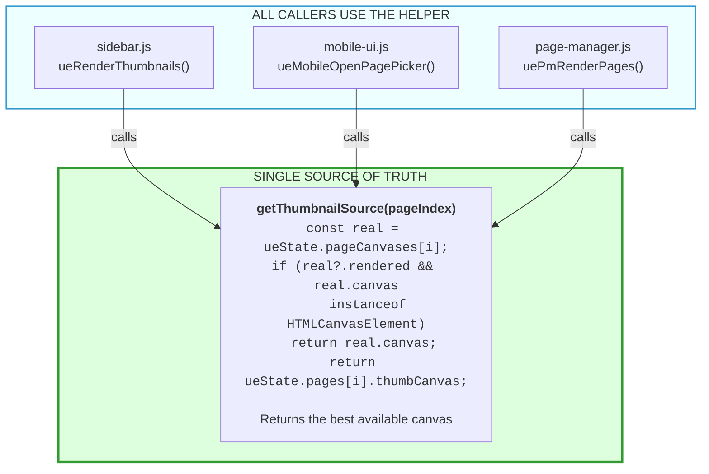
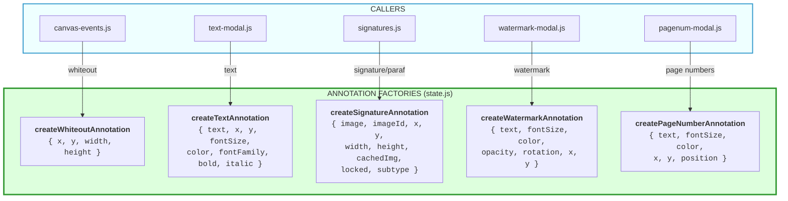

# PDFLokal Architecture: SSOT Patterns

This document explains PDFLokal's centralized (SSOT) architecture for object creation, state management, and shared logic. These patterns were introduced in Feb 2026 to replace scattered, error-prone duplication.

---

## 1. Current Architecture: Centralized SSOT Helpers

### 1a. Page Object Factory — `createPageInfo()` (state.js)

A single factory in `js/lib/state.js` is the only way to create page objects. All callers get a guaranteed shape with defaults.

**Adding a new field** (e.g., `locked: false`): change `createPageInfo()` once. All creators and consumers automatically get the field with its default value.

### 1b. Centralized State Defaults — `getDefaultUeState()` (state.js)

Returns the full default shape for `ueState`. Both the initial definition and `ueReset()` reference it via `Object.assign()`:

**Adding a new state field:** add it to `getDefaultUeState()` once. `ueReset()` automatically clears it. No manual sync needed. Fields with special cleanup (like `pageObserver.disconnect()`) still need explicit handling in `ueReset()`, but the value reset itself is centralized.

### 1c. Centralized Thumbnail Resolution — `getThumbnailSource()` (canvas-utils.js)

A single function resolves the best canvas for thumbnail rendering, used by all 3 UI surfaces:

### 1d. Annotation Factories (state.js)

Five factory functions ensure consistent annotation shapes across the codebase:

### 1e. Additional SSOT Helpers

| Helper | Location | Purpose |
|--------|----------|---------|
| `openModal(id)` / `closeModal(id, skip)` | navigation.js | Standard modal open/close with `.active` class + history management |
| `isPDF(file)` / `isImage(file)` | utils.js | File type validation (replaces inline `file.type ===` checks) |
| `loadPdfDocument(bytes)` | utils.js | PDF.js document loading with defensive `.slice()` (replaces raw `pdfjsLib.getDocument()`) |

---

## 2. Historical Context: The Scattered Patterns (Before SSOT)

The SSOT helpers above were introduced to solve three categories of scattered, error-prone code. This section documents the original problems for context.

### 2a. Page Object Creation Was Scattered (3 locations)

Before `createPageInfo()`, every place that created a page object manually built the same shape. The undo-redo path used `{ ...pageData }` spread which silently dropped fields like `isFromImage`.

### 2b. State Cleanup Was Scattered (2 locations)

Before `getDefaultUeState()`, `ueReset()` manually listed 20+ field assignments that had to stay in sync with the initial `ueState` definition in `state.js`. Missing a field meant stale state across sessions.

### 2c. Thumbnail Resolution Was Copy-Pasted (3 files)

Before `getThumbnailSource()`, three files (sidebar.js, mobile-ui.js, page-manager.js) each had identical 4-line canvas resolution logic. A fix in one file but not the others caused inconsistent thumbnails.
