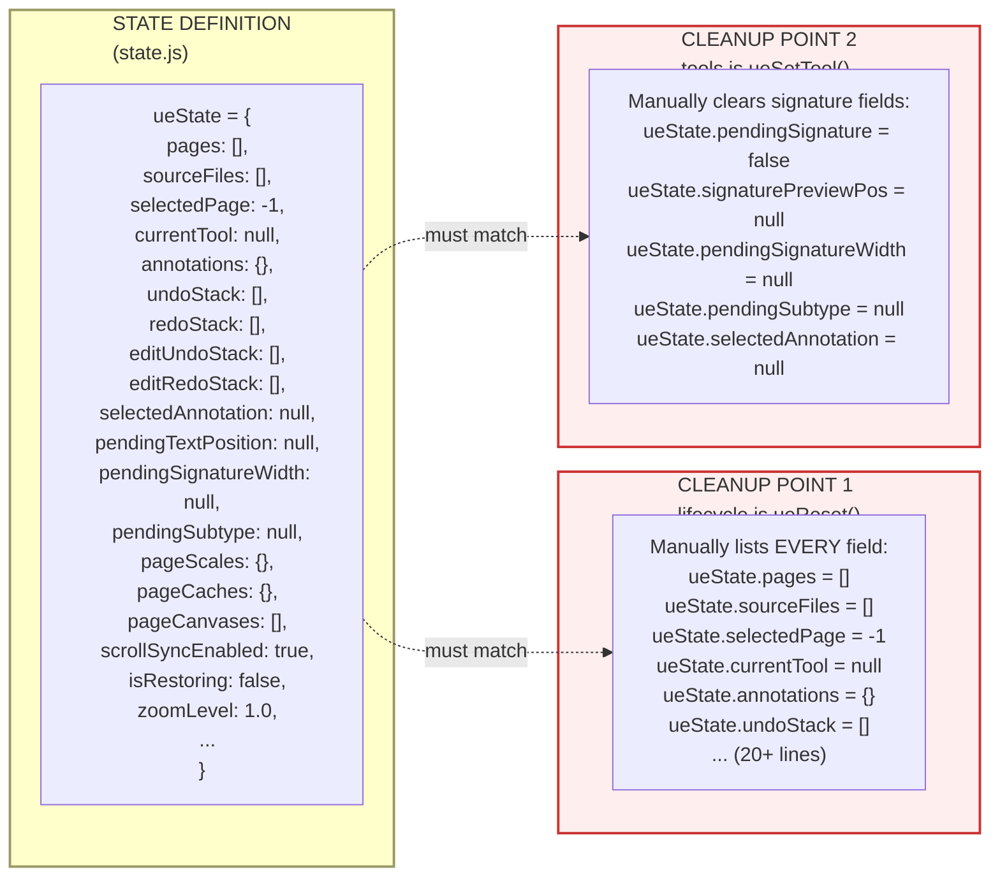
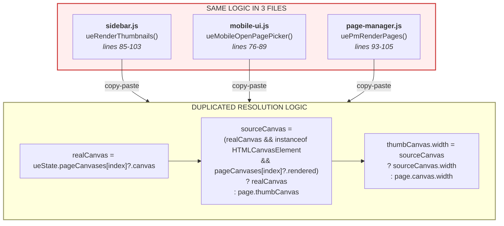
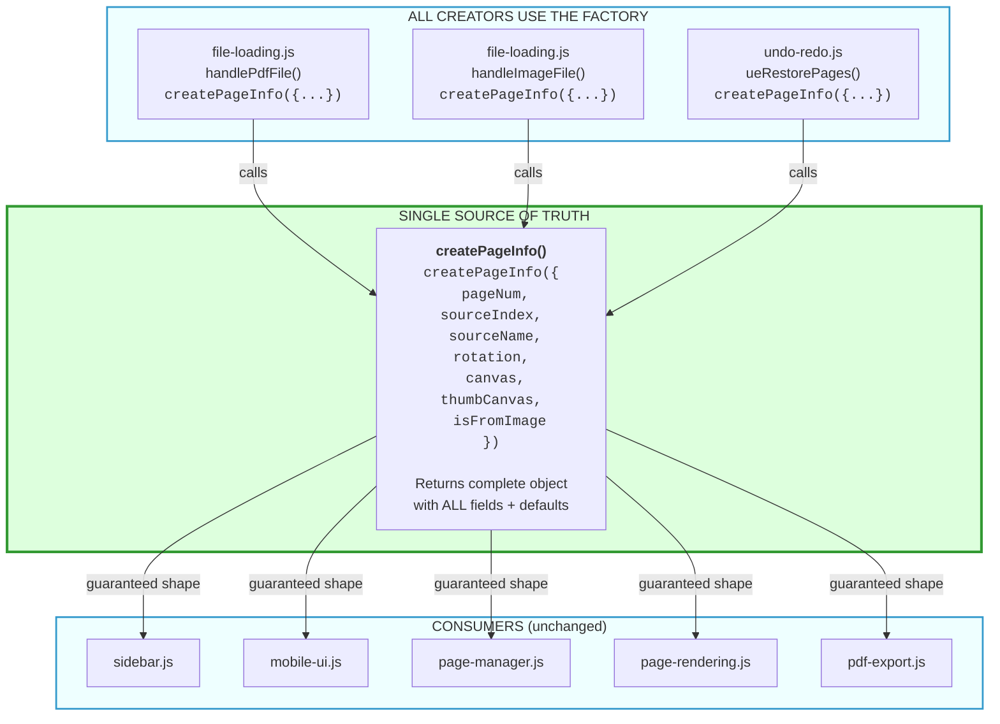
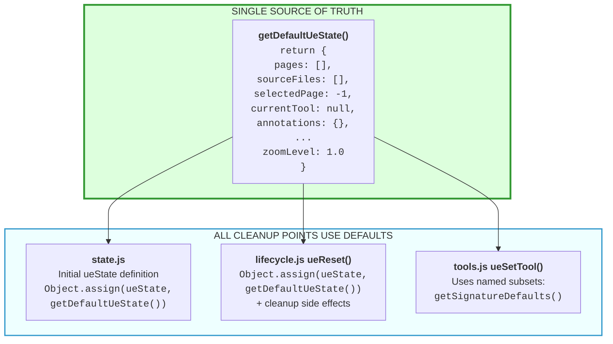
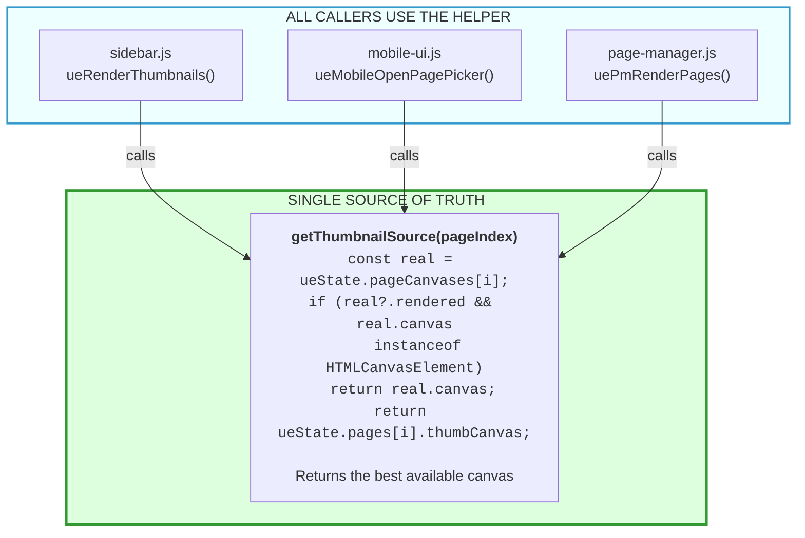

# PDFLokal Architecture: Scattered vs Centralized Patterns

This document illustrates the key architectural problem in PDFLokal's editor codebase: **scattered object creation and state cleanup** that must be kept in sync manually across multiple files. It proposes centralized (SSOT) alternatives.

---

## 1. Current State: Scattered Patterns

### 1a. Page Object Creation (3 creators, 5+ consumers)

Every place that creates a page object must manually build the same shape: `{ pageNum, sourceIndex, sourceName, rotation, canvas, thumbCanvas, isFromImage }`. If a new field is added, ALL creators must be updated or consumers will see `undefined`.

```mermaid
flowchart TB
    subgraph CREATORS["PAGE OBJECT CREATORS (3 tempat berbeda)"]
        direction TB
        FL_PDF["file-loading.js<br/><b>handlePdfFile()</b><br/><code>{ pageNum, sourceIndex,<br/>sourceName, rotation: 0,<br/>canvas, thumbCanvas,<br/>isFromImage: false }</code>"]
        FL_IMG["file-loading.js<br/><b>handleImageFile()</b><br/><code>{ pageNum: 0, sourceIndex,<br/>sourceName, rotation: 0,<br/>canvas, thumbCanvas,<br/>isFromImage: true }</code>"]
        UR["undo-redo.js<br/><b>ueRestorePages()</b><br/><code>{ ...pageData,<br/>canvas, thumbCanvas }</code><br/><i>// isFromImage lost via spread</i>"]
    end

    subgraph CONSUMERS["CONSUMERS (depend on shape being correct)"]
        direction TB
        SB["sidebar.js<br/><b>ueRenderThumbnails()</b><br/>reads page.thumbCanvas"]
        MU["mobile-ui.js<br/><b>ueMobileOpenPagePicker()</b><br/>reads page.thumbCanvas"]
        PM["page-manager.js<br/><b>uePmRenderPages()</b><br/>reads page.thumbCanvas"]
        PR["page-rendering.js<br/><b>ueRenderPageCanvas()</b><br/>reads page.sourceIndex,<br/>page.pageNum, page.rotation"]
        PE["pdf-export.js<br/><b>ueBuildFinalPDF()</b><br/>reads page.sourceIndex,<br/>page.pageNum, page.rotation"]
    end

    FL_PDF -->|push to ueState.pages| SB
    FL_PDF -->|push to ueState.pages| MU
    FL_PDF -->|push to ueState.pages| PM
    FL_PDF -->|push to ueState.pages| PR
    FL_PDF -->|push to ueState.pages| PE

    FL_IMG -->|push to ueState.pages| SB
    FL_IMG -->|push to ueState.pages| MU
    FL_IMG -->|push to ueState.pages| PM
    FL_IMG -->|push to ueState.pages| PR
    FL_IMG -->|push to ueState.pages| PE

    UR -->|rebuilds ueState.pages| SB
    UR -->|rebuilds ueState.pages| MU
    UR -->|rebuilds ueState.pages| PM
    UR -->|rebuilds ueState.pages| PR
    UR -->|rebuilds ueState.pages| PE

    style CREATORS fill:#fee,stroke:#c33,stroke-width:2px
    style CONSUMERS fill:#eff,stroke:#39c,stroke-width:2px
    style FL_PDF fill:#fdd,stroke:#c33
    style FL_IMG fill:#fdd,stroke:#c33
    style UR fill:#fdd,stroke:#c33
```



**Bug risk:** `ueRestorePages()` uses `{ ...pageData, canvas, thumbCanvas }` which spreads whatever was saved in the undo stack. The undo stack only saves `{ pageNum, sourceIndex, sourceName, rotation }` -- so `isFromImage` is lost after undo/redo. And if a new field is added to page objects (e.g., `locked`, `label`), the undo-redo path will silently drop it unless updated separately.

### 1b. State Field Cleanup (2 cleanup points, must stay in sync with state.js)

When the editor resets or a tool changes, state fields must be cleared to defaults. This is done manually in two different places:



**Bug risk:** When a new field is added to `ueState` in `state.js` (e.g., `pendingSignatureWidth` was added during a feature), every cleanup point must also be updated. `ueReset()` has 20+ manual assignments. If one is missed, stale state persists across editor sessions.

### 1c. Thumbnail Source Resolution (3 files, identical logic)

Three different files independently resolve which canvas to draw a thumbnail from. The logic is duplicated verbatim:



**Bug risk:** If the resolution logic needs to change (e.g., to prefer a cached ImageData, or handle rotation differently), it must be changed in 3 files. A fix in one file but not the others creates inconsistent thumbnail rendering.

---

## 2. Proposed: Centralized (SSOT) Pattern

### 2a. Page Object Factory

A single `createPageInfo()` function in a shared module (e.g., `js/lib/page-factory.js` or added to `state.js`) becomes the only way to create page objects:



**Adding a new field** (e.g., `locked: false`): change `createPageInfo()` once. All creators and consumers automatically get the field with its default value.

### 2b. Centralized State Defaults

A `getDefaultUeState()` function returns the full default shape for `ueState`. Both the initial definition in `state.js` and `ueReset()` in `lifecycle.js` reference it:



**Adding a new state field:** add it to `getDefaultUeState()` once. `ueReset()` automatically clears it. No manual sync needed.

### 2c. Centralized Thumbnail Resolution

A single `getThumbnailSource(pageIndex)` function replaces the duplicated logic in 3 files:



**Changing resolution logic:** update `getThumbnailSource()` once. All three UI surfaces get consistent behavior.

---

## Report: Scattered Patterns Inventory

### Scattered patterns found

#### 1. Page object creation -- 3 locations

| File | Function | Notes |
|------|----------|-------|
| `js/editor/file-loading.js` | `handlePdfFile()` (line 114) | Creates `{ pageNum, sourceIndex, sourceName, rotation: 0, canvas, thumbCanvas, isFromImage: false }` |
| `js/editor/file-loading.js` | `handleImageFile()` (line 155) | Creates `{ pageNum: 0, sourceIndex, sourceName, rotation: 0, canvas, thumbCanvas, isFromImage: true }` |
| `js/editor/undo-redo.js` | `ueRestorePages()` (line 101) | Creates `{ ...pageData, canvas, thumbCanvas }` -- spreads saved data, **loses `isFromImage`** |

The undo stack saves only `{ pageNum, sourceIndex, sourceName, rotation }` (line 44-49), so `isFromImage` and any future fields are silently dropped during undo/redo.

#### 2. State field cleanup -- 2 locations

| File | Function | What it clears |
|------|----------|---------------|
| `js/editor/lifecycle.js` | `ueReset()` (line 14) | Manually resets 20+ fields: `pages`, `sourceFiles`, `selectedPage`, `currentTool`, `annotations`, `undoStack`, `redoStack`, `editUndoStack`, `editRedoStack`, `selectedAnnotation`, `pendingTextPosition`, `pendingSignatureWidth`, `pendingSubtype`, `pageScales`, `pageCaches`, `pageCanvases`, `scrollSyncEnabled`, `isRestoring`, `zoomLevel`, plus disconnects `pageObserver` |
| `js/editor/tools.js` | `ueSetTool()` (line 15) | Partially clears signature-related fields: `selectedAnnotation`, `pendingSignature`, `signaturePreviewPos`, `pendingSignatureWidth`, `pendingSubtype` |

Note: `ueReset()` does **not** clear `pendingSignature`, `signaturePreviewPos`, `resizeHandle`, `resizeStartInfo`, `isDragging`, `isResizing`, `sidebarDropIndicator`, `lastLockedToastAnnotation`, `eventsSetup`, or `devicePixelRatio`. Some of these may be intentional (guards that persist), but there is no documentation of which fields are intentionally excluded.

#### 3. Thumbnail source resolution -- 3 locations

| File | Function | Lines |
|------|----------|-------|
| `js/editor/sidebar.js` | `ueRenderThumbnails()` | Lines 85-103: `realCanvas = pageCanvases[index]?.canvas`, then ternary for `rendered ? realCanvas : page.thumbCanvas` |
| `js/mobile-ui.js` | `ueMobileOpenPagePicker()` | Lines 76-89: identical pattern with `realCanvas`, `instanceof HTMLCanvasElement`, `rendered` check |
| `js/editor/page-manager.js` | `uePmRenderPages()` | Lines 93-105: identical pattern, verbatim copy-paste |

All three use the exact same 4-line resolution:
```js
const realCanvas = ueState.pageCanvases[index]?.canvas;
const sourceCanvas = (realCanvas && realCanvas instanceof HTMLCanvasElement && ueState.pageCanvases[index]?.rendered)
  ? realCanvas
  : page.thumbCanvas;
```

### Proposed centralized helpers

#### 1. `createPageInfo({ pageNum, sourceIndex, sourceName, rotation, canvas, thumbCanvas, isFromImage })`

- **Location:** `js/lib/state.js` (or new `js/lib/page-factory.js`)
- **Purpose:** Single factory for page objects with guaranteed shape and defaults
- **Default values:** `rotation: 0`, `isFromImage: false`, `thumbCanvas: null`
- **Used by:** `handlePdfFile()`, `handleImageFile()`, `ueRestorePages()`
- **Benefit:** New fields automatically get defaults; undo/redo cannot lose fields

#### 2. `getDefaultUeState()`

- **Location:** `js/lib/state.js`
- **Purpose:** Returns the full default state object for `ueState`
- **Used by:** initial `ueState` definition in `state.js`, `ueReset()` in `lifecycle.js`
- **Benefit:** Adding a field to `ueState` means adding it in one place; `ueReset()` uses `Object.assign(ueState, getDefaultUeState())` instead of 20+ manual lines
- **Note:** Fields with special cleanup (like `pageObserver.disconnect()`) still need explicit handling in `ueReset()`, but the value reset itself is centralized

#### 3. `getThumbnailSource(pageIndex)`

- **Location:** `js/editor/canvas-utils.js` (already houses `ueGetCurrentCanvas()` and other canvas helpers)
- **Purpose:** Resolves the best canvas to use for thumbnail rendering -- prefers rendered main canvas, falls back to pre-rendered `thumbCanvas`
- **Used by:** `ueRenderThumbnails()`, `ueMobileOpenPagePicker()`, `uePmRenderPages()`
- **Benefit:** One change to resolution logic applies everywhere; eliminates 3x copy-paste
