# PDFLokal System Flow — Every User Action in Detail

> Generated 2026-02-20. Covers every user-facing action from homepage to download.

---

## 1. High-Level System Overview

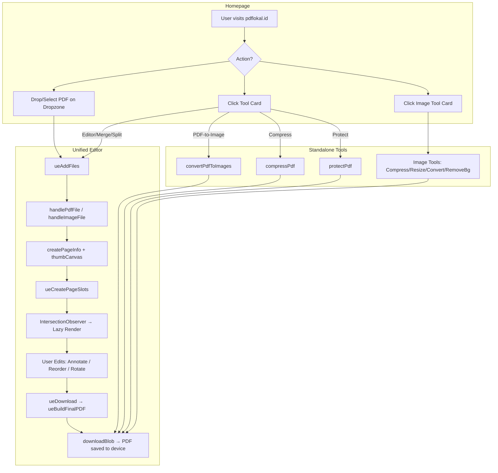
```mermaid
graph TB
    subgraph Homepage
        A[User visits pdflokal.id] --> B{Action?}
        B --> C[Drop/Select PDF on Dropzone]
        B --> D[Click Tool Card]
        B --> E[Click Image Tool Card]
    end

    subgraph "Unified Editor"
        C --> F[ueAddFiles]
        D -->|Editor/Merge/Split| F
        F --> G[handlePdfFile / handleImageFile]
        G --> H[createPageInfo + thumbCanvas]
        H --> I[ueCreatePageSlots]
        I --> J[IntersectionObserver → Lazy Render]
        J --> K[User Edits: Annotate / Reorder / Rotate]
        K --> L[ueDownload → ueBuildFinalPDF]
        L --> M[downloadBlob → PDF saved to device]
    end

    subgraph "Standalone Tools"
        D -->|PDF-to-Image| N[convertPdfToImages]
        D -->|Compress| O[compressPdf]
        D -->|Protect| P[protectPdf]
        E --> Q[Image Tools: Compress/Resize/Convert/RemoveBg]
    end

    N --> M
    O --> M
    P --> M
    Q --> M
```

---

## 2. File Loading Pipeline

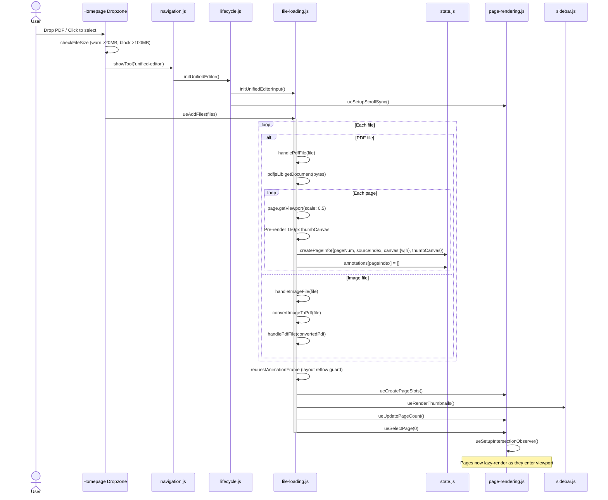
```mermaid
sequenceDiagram
    actor User
    participant Dropzone as Homepage Dropzone
    participant Nav as navigation.js
    participant Init as lifecycle.js
    participant FL as file-loading.js
    participant State as state.js
    participant PR as page-rendering.js
    participant Sidebar as sidebar.js

    User->>Dropzone: Drop PDF / Click to select
    Dropzone->>Dropzone: checkFileSize (warn >20MB, block >100MB)
    Dropzone->>Nav: showTool('unified-editor')
    Nav->>Init: initUnifiedEditor()
    Init->>FL: initUnifiedEditorInput()
    Init->>PR: ueSetupScrollSync()

    Dropzone->>FL: ueAddFiles(files)
    activate FL

    loop Each file
        alt PDF file
            FL->>FL: handlePdfFile(file)
            FL->>FL: pdfjsLib.getDocument(bytes)
            loop Each page
                FL->>FL: page.getViewport(scale: 0.5)
                FL->>FL: Pre-render 150px thumbCanvas
                FL->>State: createPageInfo({pageNum, sourceIndex, canvas:{w,h}, thumbCanvas})
                FL->>State: annotations[pageIndex] = []
            end
        else Image file
            FL->>FL: handleImageFile(file)
            FL->>FL: convertImageToPdf(file)
            FL->>FL: handlePdfFile(convertedPdf)
        end
    end

    FL->>FL: requestAnimationFrame (layout reflow guard)
    FL->>PR: ueCreatePageSlots()
    FL->>Sidebar: ueRenderThumbnails()
    FL->>PR: ueUpdatePageCount()
    FL->>PR: ueSelectPage(0)
    deactivate FL

    PR->>PR: ueSetupIntersectionObserver()
    Note over PR: Pages now lazy-render as they enter viewport
```

---

## 3. Lazy Page Rendering (IntersectionObserver)

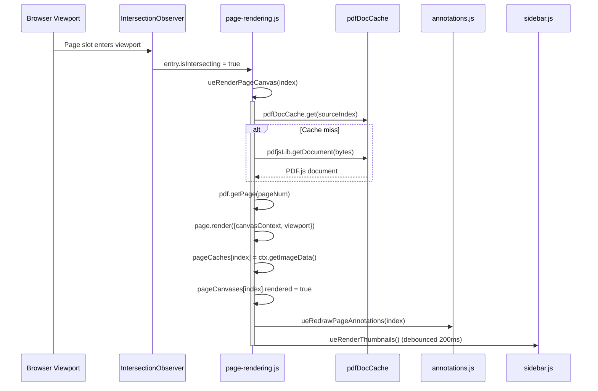
```mermaid
sequenceDiagram
    participant Viewport as Browser Viewport
    participant IO as IntersectionObserver
    participant PR as page-rendering.js
    participant Cache as pdfDocCache
    participant Anno as annotations.js
    participant Sidebar as sidebar.js

    Viewport->>IO: Page slot enters viewport
    IO->>PR: entry.isIntersecting = true

    PR->>PR: ueRenderPageCanvas(index)
    activate PR
    PR->>Cache: pdfDocCache.get(sourceIndex)
    alt Cache miss
        PR->>Cache: pdfjsLib.getDocument(bytes)
        Cache-->>PR: PDF.js document
    end
    PR->>PR: pdf.getPage(pageNum)
    PR->>PR: page.render({canvasContext, viewport})
    PR->>PR: pageCaches[index] = ctx.getImageData()
    PR->>PR: pageCanvases[index].rendered = true
    PR->>Anno: ueRedrawPageAnnotations(index)
    PR->>Sidebar: ueRenderThumbnails() (debounced 200ms)
    deactivate PR
```

---

## 4. Whiteout Annotation Flow

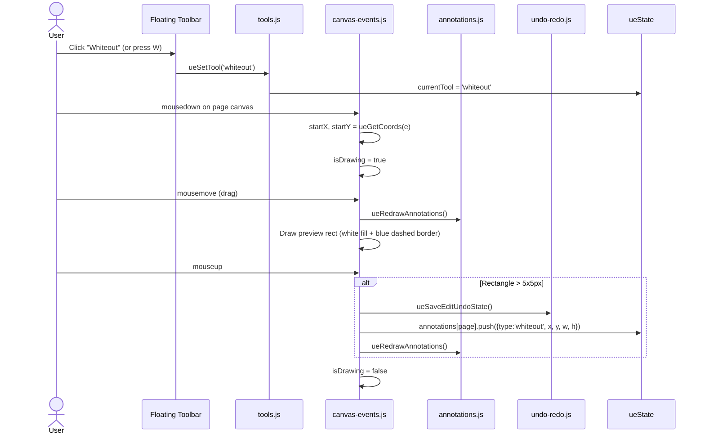
```mermaid
sequenceDiagram
    actor User
    participant Toolbar as Floating Toolbar
    participant Tools as tools.js
    participant CE as canvas-events.js
    participant Anno as annotations.js
    participant Undo as undo-redo.js
    participant State as ueState

    User->>Toolbar: Click "Whiteout" (or press W)
    Toolbar->>Tools: ueSetTool('whiteout')
    Tools->>State: currentTool = 'whiteout'

    User->>CE: mousedown on page canvas
    CE->>CE: startX, startY = ueGetCoords(e)
    CE->>CE: isDrawing = true

    User->>CE: mousemove (drag)
    CE->>Anno: ueRedrawAnnotations()
    CE->>CE: Draw preview rect (white fill + blue dashed border)

    User->>CE: mouseup
    alt Rectangle > 5x5px
        CE->>Undo: ueSaveEditUndoState()
        CE->>State: annotations[page].push({type:'whiteout', x, y, w, h})
        CE->>Anno: ueRedrawAnnotations()
    end
    CE->>CE: isDrawing = false
```

---

## 5. Text Annotation Flow

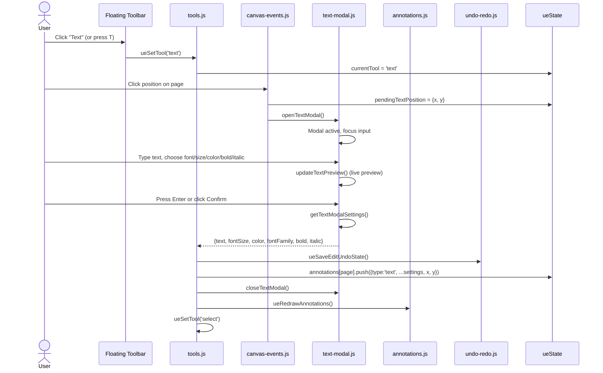
```mermaid
sequenceDiagram
    actor User
    participant Toolbar as Floating Toolbar
    participant Tools as tools.js
    participant CE as canvas-events.js
    participant TM as text-modal.js
    participant Anno as annotations.js
    participant Undo as undo-redo.js
    participant State as ueState

    User->>Toolbar: Click "Text" (or press T)
    Toolbar->>Tools: ueSetTool('text')
    Tools->>State: currentTool = 'text'

    User->>CE: Click position on page
    CE->>State: pendingTextPosition = {x, y}
    CE->>TM: openTextModal()
    TM->>TM: Modal active, focus input

    User->>TM: Type text, choose font/size/color/bold/italic
    TM->>TM: updateTextPreview() (live preview)

    User->>TM: Press Enter or click Confirm
    TM->>TM: getTextModalSettings()
    TM-->>Tools: {text, fontSize, color, fontFamily, bold, italic}
    Tools->>Undo: ueSaveEditUndoState()
    Tools->>State: annotations[page].push({type:'text', ...settings, x, y})
    Tools->>TM: closeTextModal()
    Tools->>Anno: ueRedrawAnnotations()
    Tools->>Tools: ueSetTool('select')
```

---

## 6. Signature Flow (Upload Path)

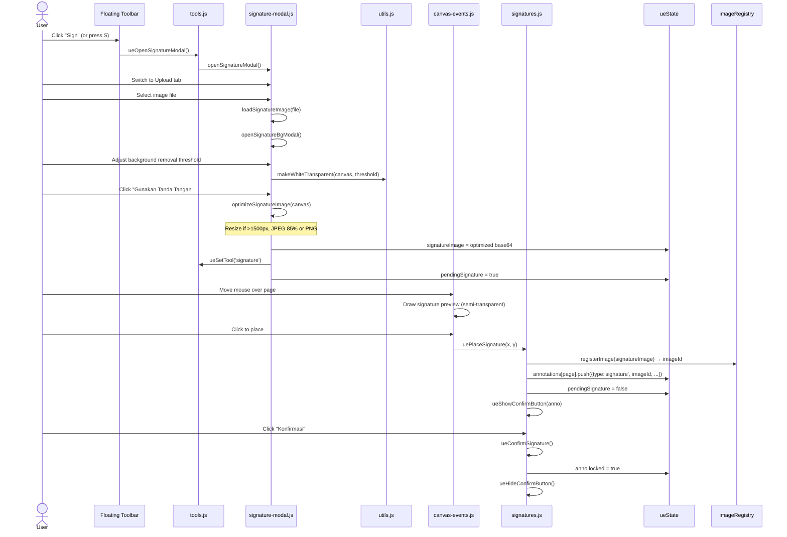
```mermaid
sequenceDiagram
    actor User
    participant Toolbar as Floating Toolbar
    participant Tools as tools.js
    participant SM as signature-modal.js
    participant Utils as utils.js
    participant CE as canvas-events.js
    participant Sig as signatures.js
    participant State as ueState
    participant ImgReg as imageRegistry

    User->>Toolbar: Click "Sign" (or press S)
    Toolbar->>Tools: ueOpenSignatureModal()
    Tools->>SM: openSignatureModal()

    User->>SM: Switch to Upload tab
    User->>SM: Select image file
    SM->>SM: loadSignatureImage(file)
    SM->>SM: openSignatureBgModal()

    User->>SM: Adjust background removal threshold
    SM->>Utils: makeWhiteTransparent(canvas, threshold)

    User->>SM: Click "Gunakan Tanda Tangan"
    SM->>SM: optimizeSignatureImage(canvas)
    Note over SM: Resize if >1500px, JPEG 85% or PNG
    SM->>State: signatureImage = optimized base64
    SM->>Tools: ueSetTool('signature')
    SM->>State: pendingSignature = true

    User->>CE: Move mouse over page
    CE->>CE: Draw signature preview (semi-transparent)

    User->>CE: Click to place
    CE->>Sig: uePlaceSignature(x, y)
    Sig->>ImgReg: registerImage(signatureImage) → imageId
    Sig->>State: annotations[page].push({type:'signature', imageId, ...})
    Sig->>State: pendingSignature = false
    Sig->>Sig: ueShowConfirmButton(anno)

    User->>Sig: Click "Konfirmasi"
    Sig->>Sig: ueConfirmSignature()
    Sig->>State: anno.locked = true
    Sig->>Sig: ueHideConfirmButton()
```

---

## 7. Signature Flow (Draw Path)

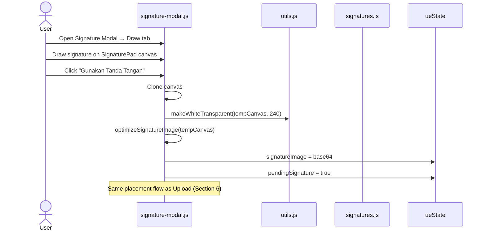
```mermaid
sequenceDiagram
    actor User
    participant SM as signature-modal.js
    participant Utils as utils.js
    participant Sig as signatures.js
    participant State as ueState

    User->>SM: Open Signature Modal → Draw tab
    User->>SM: Draw signature on SignaturePad canvas

    User->>SM: Click "Gunakan Tanda Tangan"
    SM->>SM: Clone canvas
    SM->>Utils: makeWhiteTransparent(tempCanvas, 240)
    SM->>SM: optimizeSignatureImage(tempCanvas)
    SM->>State: signatureImage = base64
    SM->>State: pendingSignature = true
    Note over SM: Same placement flow as Upload (Section 6)
```

---

## 8. Paraf (Initials) Flow — Including "Apply to All Pages"

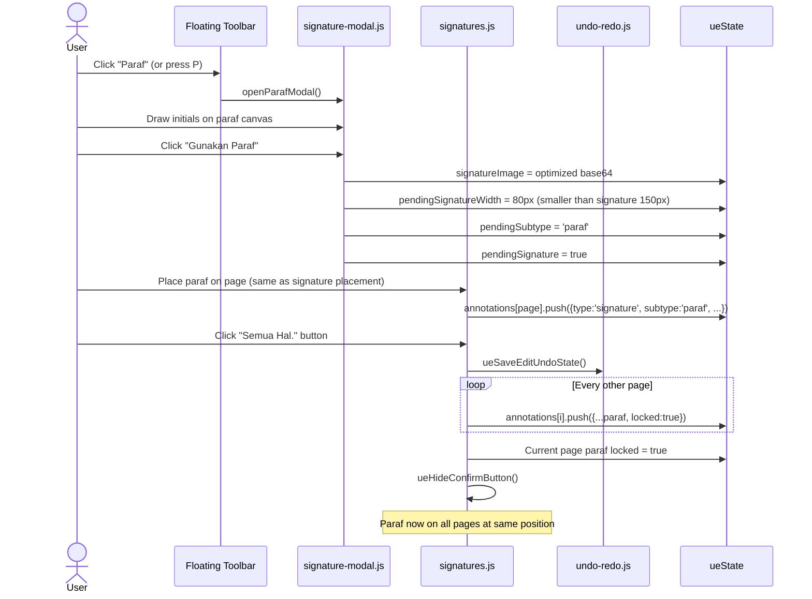
```mermaid
sequenceDiagram
    actor User
    participant Toolbar as Floating Toolbar
    participant SM as signature-modal.js
    participant Sig as signatures.js
    participant Undo as undo-redo.js
    participant State as ueState

    User->>Toolbar: Click "Paraf" (or press P)
    Toolbar->>SM: openParafModal()

    User->>SM: Draw initials on paraf canvas
    User->>SM: Click "Gunakan Paraf"
    SM->>State: signatureImage = optimized base64
    SM->>State: pendingSignatureWidth = 80px (smaller than signature 150px)
    SM->>State: pendingSubtype = 'paraf'
    SM->>State: pendingSignature = true

    User->>Sig: Place paraf on page (same as signature placement)
    Sig->>State: annotations[page].push({type:'signature', subtype:'paraf', ...})

    User->>Sig: Click "Semua Hal." button
    Sig->>Undo: ueSaveEditUndoState()
    loop Every other page
        Sig->>State: annotations[i].push({...paraf, locked:true})
    end
    Sig->>State: Current page paraf locked = true
    Sig->>Sig: ueHideConfirmButton()
    Note over Sig: Paraf now on all pages at same position
```

---

## 9. Annotation Selection, Drag, Resize, Inline Edit

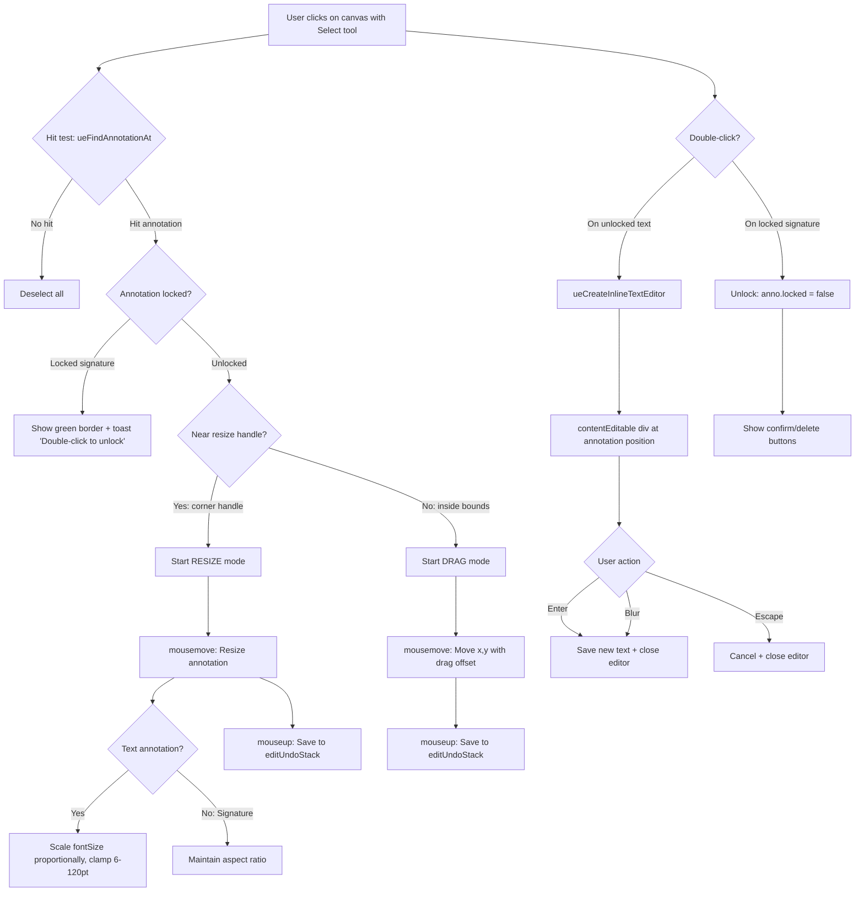
```mermaid
flowchart TD
    A[User clicks on canvas with Select tool] --> B{Hit test: ueFindAnnotationAt}
    B -->|No hit| C[Deselect all]
    B -->|Hit annotation| D{Annotation locked?}

    D -->|Locked signature| E[Show green border + toast 'Double-click to unlock']
    D -->|Unlocked| F{Near resize handle?}

    F -->|Yes: corner handle| G[Start RESIZE mode]
    F -->|No: inside bounds| H[Start DRAG mode]

    G --> I[mousemove: Resize annotation]
    I --> J{Text annotation?}
    J -->|Yes| K[Scale fontSize proportionally, clamp 6-120pt]
    J -->|No: Signature| L[Maintain aspect ratio]
    I --> M[mouseup: Save to editUndoStack]

    H --> N[mousemove: Move x,y with drag offset]
    N --> O[mouseup: Save to editUndoStack]

    A --> P{Double-click?}
    P -->|On unlocked text| Q[ueCreateInlineTextEditor]
    Q --> R[contentEditable div at annotation position]
    R --> S{User action}
    S -->|Enter| T[Save new text + close editor]
    S -->|Escape| U[Cancel + close editor]
    S -->|Blur| T

    P -->|On locked signature| V[Unlock: anno.locked = false]
    V --> W[Show confirm/delete buttons]
```

---

## 10. Page Manager (Gabungkan Modal)

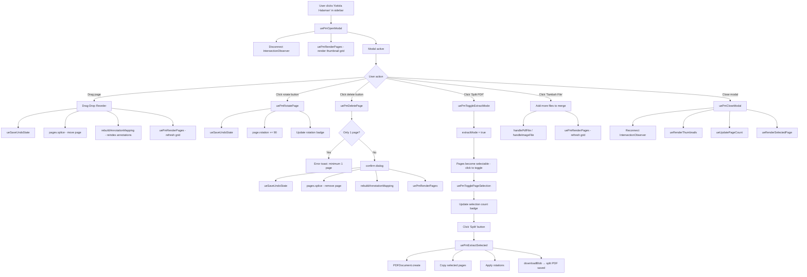
```mermaid
flowchart TD
    A[User clicks 'Kelola Halaman' in sidebar] --> B[uePmOpenModal]
    B --> C[Disconnect IntersectionObserver]
    B --> D[uePmRenderPages - render thumbnail grid]
    B --> E[Modal active]

    E --> F{User action}

    F -->|Drag page| G[Drag-Drop Reorder]
    G --> G1[ueSaveUndoState]
    G --> G2[pages.splice - move page]
    G --> G3[rebuildAnnotationMapping - reindex annotations]
    G --> G4[uePmRenderPages - refresh grid]

    F -->|Click rotate button| H[uePmRotatePage]
    H --> H1[ueSaveUndoState]
    H --> H2[page.rotation += 90]
    H --> H3[Update rotation badge]

    F -->|Click delete button| I[uePmDeletePage]
    I --> I1{Only 1 page?}
    I1 -->|Yes| I2[Error toast: minimum 1 page]
    I1 -->|No| I3[confirm dialog]
    I3 --> I4[ueSaveUndoState]
    I3 --> I5[pages.splice - remove page]
    I3 --> I6[rebuildAnnotationMapping]
    I3 --> I7[uePmRenderPages]

    F -->|Click 'Split PDF'| J[uePmToggleExtractMode]
    J --> K[extractMode = true]
    K --> L[Pages become selectable - click to toggle]
    L --> M[uePmTogglePageSelection]
    M --> N[Update selection count badge]
    N --> O[Click 'Split' button]
    O --> P[uePmExtractSelected]
    P --> P1[PDFDocument.create]
    P --> P2[Copy selected pages]
    P --> P3[Apply rotations]
    P --> P4[downloadBlob → split PDF saved]

    F -->|Click 'Tambah File'| Q[Add more files to merge]
    Q --> Q1[handlePdfFile / handleImageFile]
    Q --> Q2[uePmRenderPages - refresh grid]

    F -->|Close modal| R[uePmCloseModal]
    R --> R1[Reconnect IntersectionObserver]
    R --> R2[ueRenderThumbnails]
    R --> R3[ueUpdatePageCount]
    R --> R4[ueRenderSelectedPage]
```

---

## 11. Zoom and Rotate

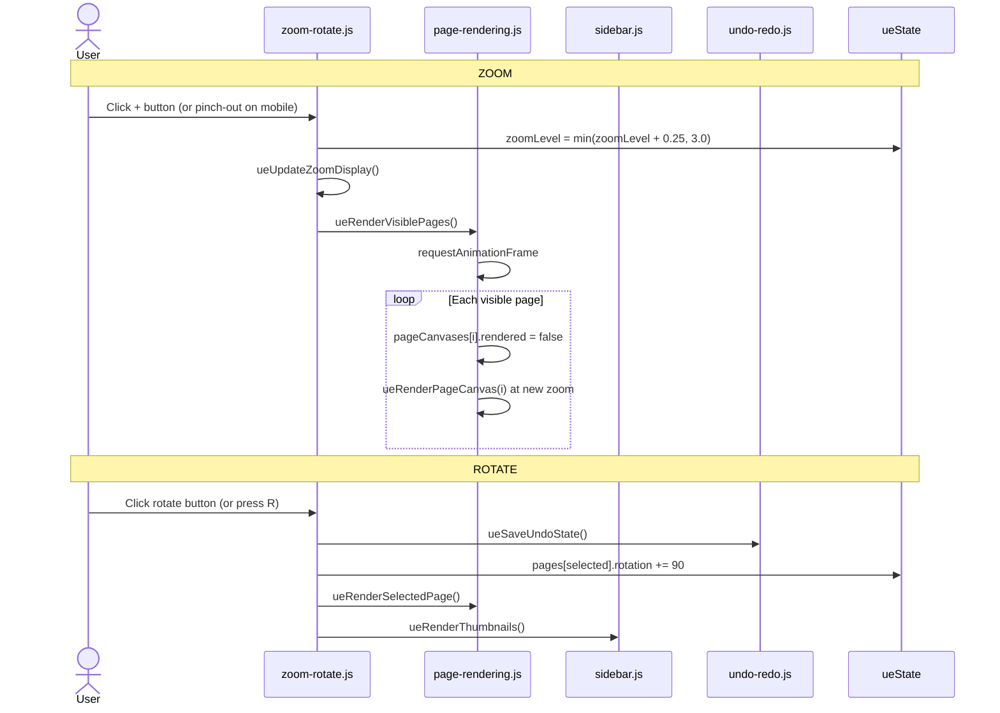
```mermaid
sequenceDiagram
    actor User
    participant ZR as zoom-rotate.js
    participant PR as page-rendering.js
    participant Sidebar as sidebar.js
    participant Undo as undo-redo.js
    participant State as ueState

    Note over User,State: ZOOM
    User->>ZR: Click + button (or pinch-out on mobile)
    ZR->>State: zoomLevel = min(zoomLevel + 0.25, 3.0)
    ZR->>ZR: ueUpdateZoomDisplay()
    ZR->>PR: ueRenderVisiblePages()
    PR->>PR: requestAnimationFrame
    loop Each visible page
        PR->>PR: pageCanvases[i].rendered = false
        PR->>PR: ueRenderPageCanvas(i) at new zoom
    end

    Note over User,State: ROTATE
    User->>ZR: Click rotate button (or press R)
    ZR->>Undo: ueSaveUndoState()
    ZR->>State: pages[selected].rotation += 90
    ZR->>PR: ueRenderSelectedPage()
    ZR->>Sidebar: ueRenderThumbnails()
```

---

## 12. Undo/Redo System (Dual Stacks)

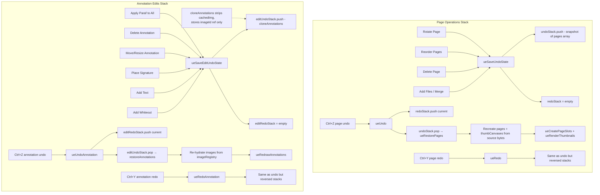
```mermaid
flowchart TD
    subgraph "Page Operations Stack"
        A1[Rotate Page] --> S1[ueSaveUndoState]
        A2[Reorder Pages] --> S1
        A3[Delete Page] --> S1
        A4[Add Files / Merge] --> S1
        S1 --> US1[undoStack.push - snapshot of pages array]
        S1 --> RS1[redoStack = empty]

        U1[Ctrl+Z page undo] --> UR1[ueUndo]
        UR1 --> UR2[redoStack.push current]
        UR1 --> UR3[undoStack.pop → ueRestorePages]
        UR3 --> UR4[Recreate pages + thumbCanvases from source bytes]
        UR4 --> UR5[ueCreatePageSlots + ueRenderThumbnails]

        R1[Ctrl+Y page redo] --> RR1[ueRedo]
        RR1 --> RR2[Same as undo but reversed stacks]
    end

    subgraph "Annotation Edits Stack"
        B1[Add Whiteout] --> S2[ueSaveEditUndoState]
        B2[Add Text] --> S2
        B3[Place Signature] --> S2
        B4[Move/Resize Annotation] --> S2
        B5[Delete Annotation] --> S2
        B6[Apply Paraf to All] --> S2
        S2 --> US2[editUndoStack.push - cloneAnnotations]
        S2 --> RS2[editRedoStack = empty]

        Note1[cloneAnnotations strips cachedImg,<br/>stores imageId ref only] -.-> US2

        U2[Ctrl+Z annotation undo] --> UR6[ueUndoAnnotation]
        UR6 --> UR7[editRedoStack.push current]
        UR6 --> UR8[editUndoStack.pop → restoreAnnotations]
        UR8 --> UR9[Re-hydrate images from imageRegistry]
        UR9 --> UR10[ueRedrawAnnotations]

        R2[Ctrl+Y annotation redo] --> RR3[ueRedoAnnotation]
        RR3 --> RR4[Same as undo but reversed stacks]
    end
```

---

## 13. PDF Export and Download (THE FINAL FLOW)

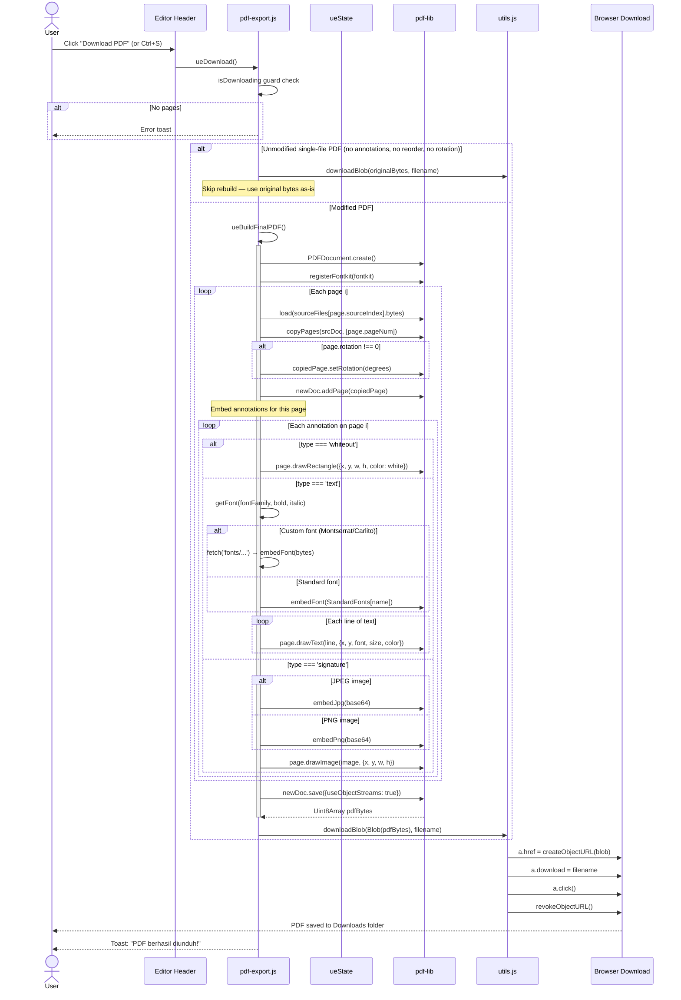
```mermaid
sequenceDiagram
    actor User
    participant Header as Editor Header
    participant Export as pdf-export.js
    participant State as ueState
    participant PDFLib as pdf-lib
    participant Utils as utils.js
    participant Browser as Browser Download

    User->>Header: Click "Download PDF" (or Ctrl+S)
    Header->>Export: ueDownload()
    Export->>Export: isDownloading guard check

    alt No pages
        Export-->>User: Error toast
    end

    alt Unmodified single-file PDF (no annotations, no reorder, no rotation)
        Export->>Utils: downloadBlob(originalBytes, filename)
        Note over Export: Skip rebuild — use original bytes as-is
    else Modified PDF
        Export->>Export: ueBuildFinalPDF()
        activate Export

        Export->>PDFLib: PDFDocument.create()
        Export->>PDFLib: registerFontkit(fontkit)

        loop Each page i
            Export->>PDFLib: load(sourceFiles[page.sourceIndex].bytes)
            Export->>PDFLib: copyPages(srcDoc, [page.pageNum])
            alt page.rotation !== 0
                Export->>PDFLib: copiedPage.setRotation(degrees)
            end
            Export->>PDFLib: newDoc.addPage(copiedPage)

            Note over Export: Embed annotations for this page

            loop Each annotation on page i
                alt type === 'whiteout'
                    Export->>PDFLib: page.drawRectangle({x, y, w, h, color: white})
                else type === 'text'
                    Export->>Export: getFont(fontFamily, bold, italic)
                    alt Custom font (Montserrat/Carlito)
                        Export->>Export: fetch('fonts/...') → embedFont(bytes)
                    else Standard font
                        Export->>PDFLib: embedFont(StandardFonts[name])
                    end
                    loop Each line of text
                        Export->>PDFLib: page.drawText(line, {x, y, font, size, color})
                    end
                else type === 'signature'
                    alt JPEG image
                        Export->>PDFLib: embedJpg(base64)
                    else PNG image
                        Export->>PDFLib: embedPng(base64)
                    end
                    Export->>PDFLib: page.drawImage(image, {x, y, w, h})
                end
            end
        end

        Export->>PDFLib: newDoc.save({useObjectStreams: true})
        PDFLib-->>Export: Uint8Array pdfBytes
        deactivate Export

        Export->>Utils: downloadBlob(Blob(pdfBytes), filename)
    end

    Utils->>Browser: a.href = createObjectURL(blob)
    Utils->>Browser: a.download = filename
    Utils->>Browser: a.click()
    Utils->>Browser: revokeObjectURL()
    Browser-->>User: PDF saved to Downloads folder
    Export-->>User: Toast: "PDF berhasil diunduh!"
```

---

## 14. Protect PDF (Password) Flow

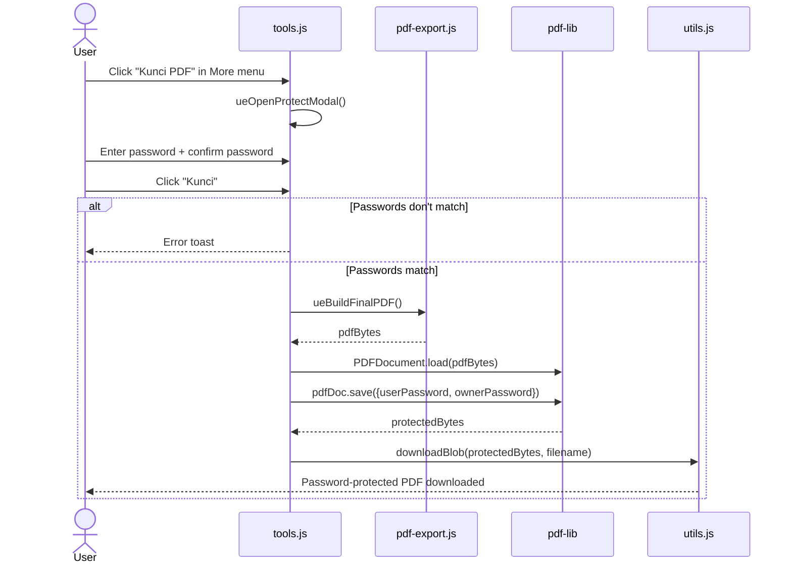
```mermaid
sequenceDiagram
    actor User
    participant Tools as tools.js
    participant Export as pdf-export.js
    participant PDFLib as pdf-lib
    participant Utils as utils.js

    User->>Tools: Click "Kunci PDF" in More menu
    Tools->>Tools: ueOpenProtectModal()

    User->>Tools: Enter password + confirm password
    User->>Tools: Click "Kunci"

    alt Passwords don't match
        Tools-->>User: Error toast
    else Passwords match
        Tools->>Export: ueBuildFinalPDF()
        Export-->>Tools: pdfBytes
        Tools->>PDFLib: PDFDocument.load(pdfBytes)
        Tools->>PDFLib: pdfDoc.save({userPassword, ownerPassword})
        PDFLib-->>Tools: protectedBytes
        Tools->>Utils: downloadBlob(protectedBytes, filename)
        Utils-->>User: Password-protected PDF downloaded
    end
```

---

## 15. Standalone Tools (Non-Editor)

```mermaid
flowchart TD
    subgraph "PDF to Image"
        PTI1[User selects PDF] --> PTI2[pdfjsLib.getDocument]
        PTI2 --> PTI3[Render each page to canvas]
        PTI3 --> PTI4{Format choice}
        PTI4 -->|PNG| PTI5[canvas.toDataURL - 'image/png']
        PTI4 -->|JPG| PTI6[canvas.toDataURL - 'image/jpeg', quality]
        PTI5 --> PTI7[downloadBlob per page]
        PTI6 --> PTI7
        PTI7 --> PTI8[Or ZIP all images]
    end

    subgraph "Compress PDF"
        CP1[User selects PDF] --> CP2[PDFDocument.load]
        CP2 --> CP3[Extract embedded images]
        CP3 --> CP4[Re-encode at lower quality]
        CP4 --> CP5[Replace images in PDF]
        CP5 --> CP6[pdfDoc.save → downloadBlob]
    end

    subgraph "Protect PDF"
        PP1[User selects PDF] --> PP2[PDFDocument.load]
        PP2 --> PP3[User enters password]
        PP3 --> PP4[pdfDoc.save with userPassword]
        PP4 --> PP5[downloadBlob → protected PDF]
    end
```

---

## 16. Image Tools

```mermaid
flowchart TD
    subgraph "Image Compress"
        IC1[User selects image] --> IC2[Draw to canvas]
        IC2 --> IC3[canvas.toBlob quality slider]
        IC3 --> IC4[downloadBlob]
    end

    subgraph "Image Resize"
        IR1[User selects image] --> IR2[Set target dimensions]
        IR2 --> IR3[Draw to resized canvas]
        IR3 --> IR4[canvas.toBlob]
        IR4 --> IR5[downloadBlob]
    end

    subgraph "Image Convert"
        CV1[User selects image] --> CV2[Draw to canvas]
        CV2 --> CV3{Target format}
        CV3 -->|JPG| CV4[toBlob image/jpeg]
        CV3 -->|PNG| CV5[toBlob image/png]
        CV3 -->|WebP| CV6[toBlob image/webp]
        CV4 --> CV7[downloadBlob]
        CV5 --> CV7
        CV6 --> CV7
    end

    subgraph "Image to PDF"
        IP1[User selects images] --> IP2[PDFDocument.create]
        IP2 --> IP3[embedImage per file]
        IP3 --> IP4[addPage per image]
        IP4 --> IP5[pdfDoc.save → downloadBlob]
    end

    subgraph "Remove Background"
        RB1[User selects image] --> RB2[Draw to canvas]
        RB2 --> RB3[makeWhiteTransparent threshold]
        RB3 --> RB4[canvas.toBlob image/png]
        RB4 --> RB5[downloadBlob]
    end
```

---

## 17. Navigation & State Machine

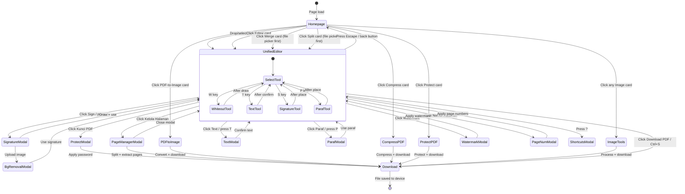
```mermaid
stateDiagram-v2
    [*] --> Homepage : Page load

    Homepage --> UnifiedEditor : Drop/select files
    Homepage --> UnifiedEditor : Click Editor card
    Homepage --> UnifiedEditor : Click Merge card (file picker first)
    Homepage --> UnifiedEditor : Click Split card (file picker first)
    Homepage --> PDFtoImage : Click PDF-to-Image card
    Homepage --> CompressPDF : Click Compress card
    Homepage --> ProtectPDF : Click Protect card
    Homepage --> ImageTools : Click any Image card

    UnifiedEditor --> SignatureModal : Click Sign / press S
    UnifiedEditor --> TextModal : Click Text / press T
    UnifiedEditor --> ParafModal : Click Paraf / press P
    UnifiedEditor --> PageManagerModal : Click Kelola Halaman
    UnifiedEditor --> ProtectModal : Click Kunci PDF
    UnifiedEditor --> WatermarkModal : Click Watermark
    UnifiedEditor --> PageNumModal : Click Nomor Halaman
    UnifiedEditor --> ShortcutsModal : Press ?

    SignatureModal --> BgRemovalModal : Upload image
    BgRemovalModal --> UnifiedEditor : Use signature
    SignatureModal --> UnifiedEditor : Draw + use
    TextModal --> UnifiedEditor : Confirm text
    ParafModal --> UnifiedEditor : Use paraf
    PageManagerModal --> UnifiedEditor : Close modal
    ProtectModal --> Download : Apply password
    WatermarkModal --> UnifiedEditor : Apply watermark
    PageNumModal --> UnifiedEditor : Apply page numbers

    UnifiedEditor --> Download : Click Download PDF / Ctrl+S
    PageManagerModal --> Download : Split + extract pages

    PDFtoImage --> Download : Convert + download
    CompressPDF --> Download : Compress + download
    ProtectPDF --> Download : Protect + download
    ImageTools --> Download : Process + download

    UnifiedEditor --> Homepage : Press Escape / back button
    Download --> [*] : File saved to device

    state UnifiedEditor {
        [*] --> SelectTool
        SelectTool --> WhiteoutTool : W key
        SelectTool --> TextTool : T key
        SelectTool --> SignatureTool : S key
        SelectTool --> ParafTool : P key
        WhiteoutTool --> SelectTool : After draw
        TextTool --> SelectTool : After confirm
        SignatureTool --> SelectTool : After place
        ParafTool --> SelectTool : After place
    }
```

---

## 18. Mobile-Specific Flow

```mermaid
flowchart TD
    A[Viewport <= 900px] --> B[detectMobile → body.is-mobile]

    B --> C[Sidebar hidden]
    B --> D[Toolbar: icon-only + fixed position]
    B --> E[Desktop bottom bar hidden]
    B --> F[Mobile bottom bar shown - 60px]

    F --> G["[< Hal 2/5 >] page navigation"]
    F --> H["[More v] tools dropdown"]
    F --> I["[Zoom -/+] zoom controls"]
    F --> J["[Sign] quick signature access"]

    K[Touch Events] --> L{Finger count}
    L -->|1 finger| M{Tool active?}
    M -->|Yes| N[Draw/place annotation, preventDefault]
    M -->|No| O[Allow scroll, no preventDefault]

    L -->|2 fingers| P[Pinch-to-zoom]
    P --> Q{Distance delta > 30px?}
    Q -->|Spreading| R[ueZoomIn]
    Q -->|Pinching| S[ueZoomOut]

    T[Double-tap] --> U{On locked signature?}
    U -->|Yes, within 300ms + 30px| V[Unlock signature]
    U -->|On text annotation| W[Open inline editor]
    W --> X[visualViewport.resize → scroll editor into view]

    Y[Inline text edit blur] --> Z[300ms delay before save]
    Note over Z: Longer delay on mobile prevents<br/>accidental saves from keyboard dismiss
```

---

## 19. Race Condition Guards

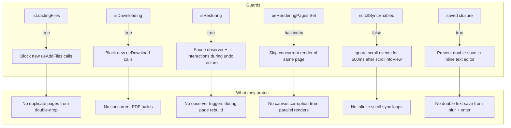
```mermaid
flowchart TD
    subgraph Guards
        G1[isLoadingFiles] -->|true| G1A[Block new ueAddFiles calls]
        G2[isDownloading] -->|true| G2A[Block new ueDownload calls]
        G3[isRestoring] -->|true| G3A[Pause observer + interactions during undo restore]
        G4[ueRenderingPages Set] -->|has index| G4A[Skip concurrent render of same page]
        G5[scrollSyncEnabled] -->|false| G5A[Ignore scroll events for 500ms after scrollIntoView]
        G6[saved closure] -->|true| G6A[Prevent double-save in inline text editor]
    end

    subgraph "What they protect"
        G1A --> P1[No duplicate pages from double-drop]
        G2A --> P2[No concurrent PDF builds]
        G3A --> P3[No observer triggers during page rebuild]
        G4A --> P4[No canvas corruption from parallel renders]
        G5A --> P5[No infinite scroll sync loops]
        G6A --> P6[No double text save from blur + enter]
    end
```

---

## 20. Complete User Journey: Drop PDF → Edit → Download

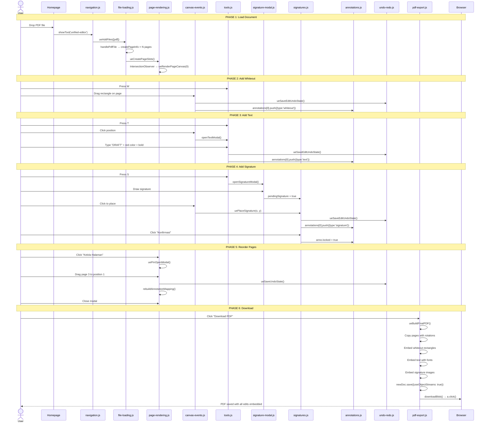
```mermaid
sequenceDiagram
    actor User
    participant Home as Homepage
    participant Nav as navigation.js
    participant FL as file-loading.js
    participant PR as page-rendering.js
    participant CE as canvas-events.js
    participant Tools as tools.js
    participant SM as signature-modal.js
    participant Sig as signatures.js
    participant Anno as annotations.js
    participant Undo as undo-redo.js
    participant Export as pdf-export.js
    participant Browser as Browser

    Note over User,Browser: PHASE 1: Load Document
    User->>Home: Drop PDF file
    Home->>Nav: showTool('unified-editor')
    Nav->>FL: ueAddFiles([pdf])
    FL->>FL: handlePdfFile → createPageInfo × N pages
    FL->>PR: ueCreatePageSlots()
    PR->>PR: IntersectionObserver → ueRenderPageCanvas(0)

    Note over User,Browser: PHASE 2: Add Whiteout
    User->>Tools: Press W
    User->>CE: Drag rectangle on page
    CE->>Undo: ueSaveEditUndoState()
    CE->>Anno: annotations[0].push({type:'whiteout'})

    Note over User,Browser: PHASE 3: Add Text
    User->>Tools: Press T
    User->>CE: Click position
    CE->>Tools: openTextModal()
    User->>Tools: Type "DRAFT" + red color + bold
    Tools->>Undo: ueSaveEditUndoState()
    Tools->>Anno: annotations[0].push({type:'text'})

    Note over User,Browser: PHASE 4: Add Signature
    User->>Tools: Press S
    Tools->>SM: openSignatureModal()
    User->>SM: Draw signature
    SM->>Sig: pendingSignature = true
    User->>CE: Click to place
    CE->>Sig: uePlaceSignature(x, y)
    Sig->>Undo: ueSaveEditUndoState()
    Sig->>Anno: annotations[0].push({type:'signature'})
    User->>Sig: Click "Konfirmasi"
    Sig->>Anno: anno.locked = true

    Note over User,Browser: PHASE 5: Reorder Pages
    User->>PR: Click "Kelola Halaman"
    PR->>PR: uePmOpenModal()
    User->>PR: Drag page 3 to position 1
    PR->>Undo: ueSaveUndoState()
    PR->>PR: rebuildAnnotationMapping()
    User->>PR: Close modal

    Note over User,Browser: PHASE 6: Download
    User->>Export: Click "Download PDF"
    Export->>Export: ueBuildFinalPDF()
    Export->>Export: Copy pages with rotations
    Export->>Export: Embed whiteout rectangles
    Export->>Export: Embed text with fonts
    Export->>Export: Embed signature images
    Export->>Export: newDoc.save({useObjectStreams: true})
    Export->>Browser: downloadBlob() → a.click()
    Browser-->>User: PDF saved with all edits embedded
```
